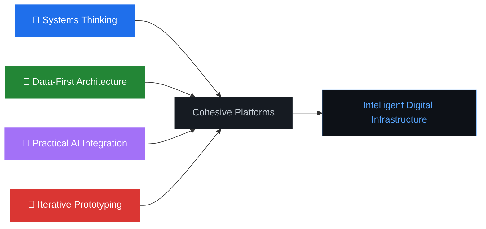

<div align="center">

<!-- Header Banner -->


<!-- Typing Animation -->
  [](https://git.io/typing-svg)

<br/>

<!-- Quick Badges -->


</div>

<br/>

## `> whoami`

```text
 ╔══════════════════════════════════════════════════════════════════════╗
 ║                                                                      ║
 ║   Engineer focused on designing intelligent software systems that    ║
 ║   combine structured data, analytics, and modern AI capabilities     ║
 ║   to create real-world digital platforms.                            ║
 ║                                                                      ║
 ║   The work sits at the intersection of:                              ║
 ║     → AI systems & LLM architectures                                 ║
 ║     → Data-driven platforms & analytics pipelines                    ║
 ║     → Digital product ecosystems                                     ║
 ║     → Intelligent decision-support systems                           ║
 ║                                                                      ║
 ╚══════════════════════════════════════════════════════════════════════╝
```

<br/>

## `> current_focus`

<table>
<tr>
<td width="50%" valign="top">

### AI & Intelligent Systems
- Multi-Agent AI Systems
- Retrieval Augmented Generation (RAG)
- Knowledge Graph-based Reasoning
- Memory Architectures for LLMs
- Autonomous AI Agents
- Human-AI Collaborative Systems

</td>
<td width="50%" valign="top">

### Platforms & Strategy
- AI-driven Analytics Platforms
- Digital Ecosystem Design
- Scalable Digital Infrastructure
- Data Governance Frameworks
- Analytical Workflow Automation
- Intelligent Decision-Support Tools

</td>
</tr>
</table>

<br/>

## `> engineering_philosophy`

<div align="center">



</div>

| Principle | Description |
|:---|:---|
| **Systems Thinking** | Software as interconnected systems — backend, databases, analytics, and UI designed together as cohesive platforms |
| **Data-First Architecture** | Systems built to capture, structure, and analyze data effectively before focusing on presentation layers |
| **Practical AI Integration** | AI as a tool for solving real problems — analytics automation, intelligent recommendations, structured reasoning |
| **Iterative Prototyping** | Rapid implementation, testing, and improvement to explore architectures before converging on scalable systems |

<br/>

## `> selected_projects`

<div align="center">

<table>
<tr>
<td width="50%" valign="top">

### Digital Platforms

<a href="https://github.com/techy-zai-fi/e-cap">

</a>

**E-Cap** — Elective management portal for IIM-BG. Digital platform for course selections, workflows & institutional processes.

<a href="https://github.com/techy-zai-fi/bloomscape-guide">

</a>

**Bloomscape Guide** — Interactive plant & garden intelligence platform with AI-driven recommendations.

<a href="https://github.com/techy-zai-fi/garden-planning">

</a>

**Garden Planning** — Structured environmental planning using data models and guided decision interfaces.

</td>
<td width="50%" valign="top">

### Governance & Coordination

<a href="https://github.com/techy-zai-fi/clan-conqueror-central">

</a>

**Clan Conqueror Central** — Group governance and collaborative decision framework platform.

<a href="https://github.com/techy-zai-fi/iimbg-election-hub">

</a>

**IIMBG Election Hub** — Transparent election management for institutional environments.

<a href="https://github.com/techy-zai-fi/fairness-compass">

</a>

**Fairness Compass** — Frameworks for evaluating fairness and transparency in digital decision systems.

</td>
</tr>
<tr>
<td width="50%" valign="top">

### Analytics & Data Systems

<a href="https://github.com/techy-zai-fi/analytics-project">

</a>

**Analytics Project** — Data exploration and analytical modeling using Python & Jupyter. Transforming raw data into actionable insights.

<a href="https://github.com/techy-zai-fi/highsfield-mixmedia-prototype">

</a>

**Highsfield Mixmedia** — Experimental AI + media processing exploring hybrid digital workflows.

</td>
<td width="50%" valign="top">

### Automation & Utilities

<a href="https://github.com/techy-zai-fi/mass-mailer">

</a>

**Mass Mailer** — Automated internal communication and structured message distribution.

<a href="https://github.com/techy-zai-fi/ppt-to-pdf-converter">

</a>

**PPT to PDF Converter** — Batch document transformation automation tool.

<a href="https://github.com/techy-zai-fi/schedule-converter">

</a>

**Schedule Converter** — Lightweight schedule data format transformation utility.

</td>
</tr>
</table>

</div>

<br/>

## `> tech_stack`

<div align="center">

### AI / Data


### Backend


### Databases


### Frontend


### DevOps


</div>

<br/>

## `> github_stats`

<div align="center">


<br/><br/>


</div>

<br/>

## `> mba_dbm_lens`

<div align="center">

```
┌─────────────────────────────────────────────────────────────────────┐
│                                                                       │
│     Beyond engineering — studying how technology platforms            │
│     scale organizations through Digital Business Management.         │
│                                                                       │
│     ┌──────────────────┐    ┌──────────────────┐                     │
│     │  Data Governance  │    │  Platform         │                    │
│     │  & Compliance     │    │  Economics        │                    │
│     └────────┬─────────┘    └────────┬─────────┘                     │
│              │                        │                               │
│              └──────────┬─────────────┘                               │
│                         ▼                                             │
│              ┌──────────────────┐                                     │
│              │  Digital          │                                    │
│              │  Ecosystems       │                                    │
│              └────────┬─────────┘                                     │
│              ┌────────┴─────────┐                                     │
│              │                  │                                     │
│     ┌────────▼────────┐  ┌─────▼──────────────┐                      │
│     │  AI-driven       │  │  Analytics for     │                     │
│     │  Decision Systems│  │  Strategy          │                     │
│     └─────────────────┘  └────────────────────┘                      │
│                                                                       │
└─────────────────────────────────────────────────────────────────────┘
```

</div>

<br/>

## `> strategic_direction`

<div align="center">

The long-term goal is building **intelligent digital infrastructures** that combine:

</div>

```
  Scalable Backend Systems ──────┐
  Structured Data Architectures ─┤
  Analytics Pipelines ───────────┼──▶  Platforms that assist in
  AI-driven Reasoning Systems ───┤     understanding & decision making
  User-centric Interfaces ──────┘
```

<div align="center">

> *Moving beyond isolated software tools toward intelligent digital infrastructures*
> *where data, automation, and analytics work together to improve how organizations operate.*

</div>

<br/>

## `> currently_exploring`

<div align="center">

| | Area | Focus |
|:---:|:---|:---|
| `01` | Autonomous AI Agents | Self-directed systems for complex task execution |
| `02` | Memory Architectures for LLMs | Persistent context and knowledge retention |
| `03` | Knowledge Graph-powered AI | Structured reasoning over connected data |
| `04` | Scalable AI Infrastructure | Production-grade intelligent systems |
| `05` | Structured Reasoning Systems | Moving AI beyond generation into reasoning |
| `06` | Collaborative Model Architectures | Multi-model systems working in concert |

</div>

<br/>

## `> connect`

<div align="center">

Always interested in discussing **AI systems**, **platform architecture**, and **digital ecosystems**.

[](https://github.com/techy-zai-fi)

<br/>

---

<sub>Each project is a step toward understanding how modern digital platforms can combine engineering, analytics, and strategic thinking to create meaningful impact.</sub>

</div>

<!-- Footer Wave -->

