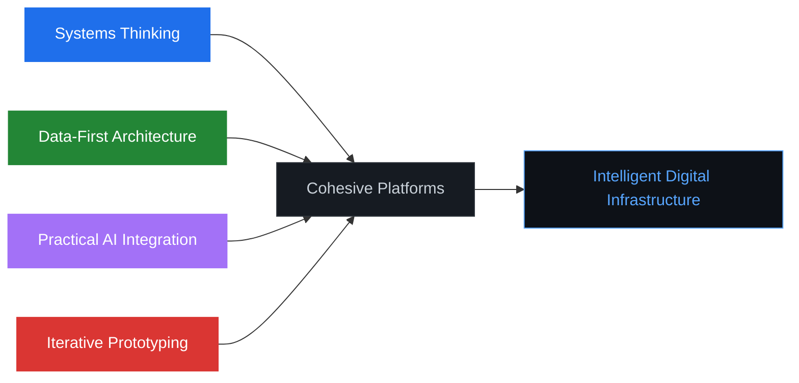
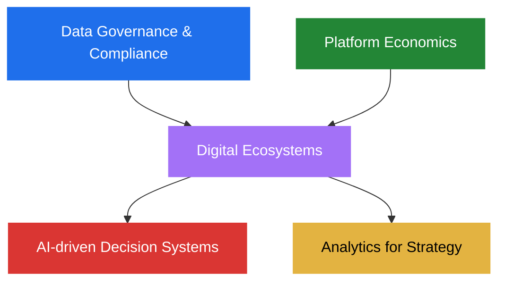

<!-- Header Banner -->

<!-- Typing Animation -->

 

<!-- Quick Badges -->

---

## About Me

> Engineer focused on designing intelligent software systems that combine structured data, analytics, and modern AI capabilities to create real-world digital platforms.

**My work sits at the intersection of:**

- **AI systems & LLM architectures** — building reasoning-capable software
- **Data-driven platforms** — turning complex data into meaningful insights
- **Digital product ecosystems** — designing scalable infrastructure
- **Intelligent decision-support systems** — analytics that drive action

The combination of engineering practice and **MBA-DBM** studies helps bridge the gap between technical system design and strategic digital transformation.

---

## Current Focus

<table>
<tr>
<td width="50%" valign="top">

<h3 align="center">AI & Intelligent Systems</h3>

</td>
<td width="50%" valign="top">

<h3 align="center">Platforms & Strategy</h3>

</td>
</tr>
</table>

---

## Engineering Philosophy

| Principle | Description |
|:---|:---|
| **Systems Thinking** | Software as interconnected systems — backend, databases, analytics, and UI designed together as cohesive platforms |
| **Data-First Architecture** | Systems built to capture, structure, and analyze data effectively before focusing on presentation layers |
| **Practical AI Integration** | AI as a tool for solving real problems — analytics automation, intelligent recommendations, structured reasoning |
| **Iterative Prototyping** | Rapid implementation, testing, and improvement to explore architectures before converging on scalable systems |

---

## Tech Stack

<h3>AI / Data</h3>

<h3>Backend</h3>

<h3>Databases</h3>

<h3>Frontend</h3>

<h3>DevOps</h3>

---

## MBA-DBM Lens

Alongside engineering systems, I study **Digital Business Management** — shaping how platforms are designed not just technically, but strategically.

---

## Strategic Direction

The long-term goal is building **intelligent digital infrastructures** that combine:

**Scalable Backend Systems** + **Structured Data Architectures** + **Analytics Pipelines** + **AI-driven Reasoning** + **User-centric Interfaces**

> *Moving beyond isolated software tools toward intelligent digital infrastructures where data, automation, and analytics work together to improve how organizations operate.*

---

## Currently Exploring

| # | Area | Focus |
|:---:|:---|:---|
| `01` | **Autonomous AI Agents** | Self-directed systems for complex task execution |
| `02` | **Memory Architectures for LLMs** | Persistent context and knowledge retention |
| `03` | **Knowledge Graph-powered AI** | Structured reasoning over connected data |
| `04` | **Scalable AI Infrastructure** | Production-grade intelligent systems |
| `05` | **Structured Reasoning Systems** | Moving AI beyond generation into reasoning |
| `06` | **Collaborative Model Architectures** | Multi-model systems working in concert |

---

## Connect

Always interested in discussing **AI systems**, **platform architecture**, and **digital ecosystems**.

 

Each project is a step toward understanding how modern digital platforms can combine engineering, analytics, and strategic thinking to create meaningful impact.

<!-- Footer Wave -->

